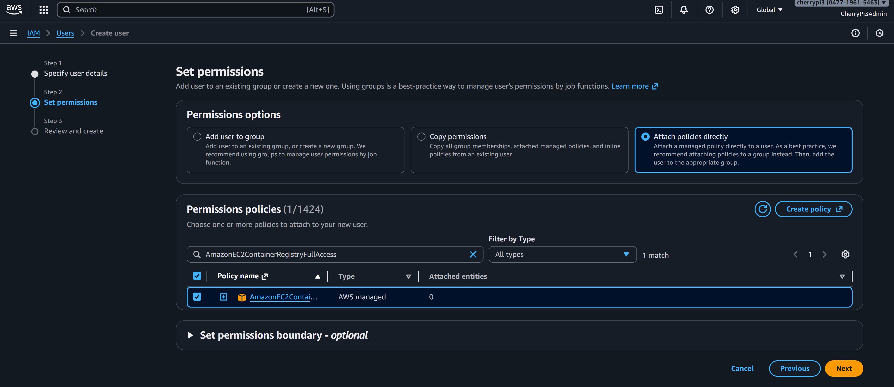
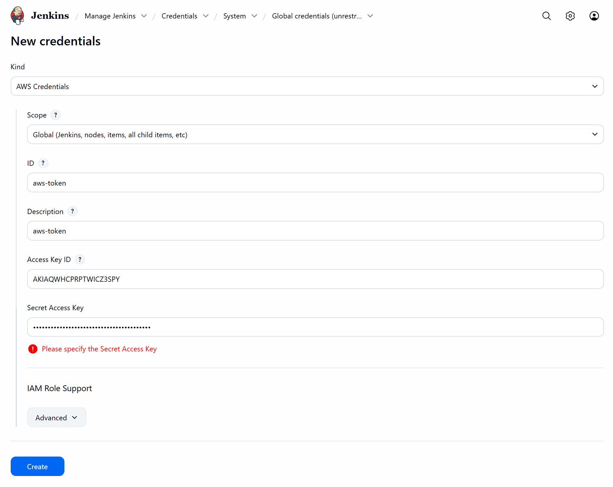
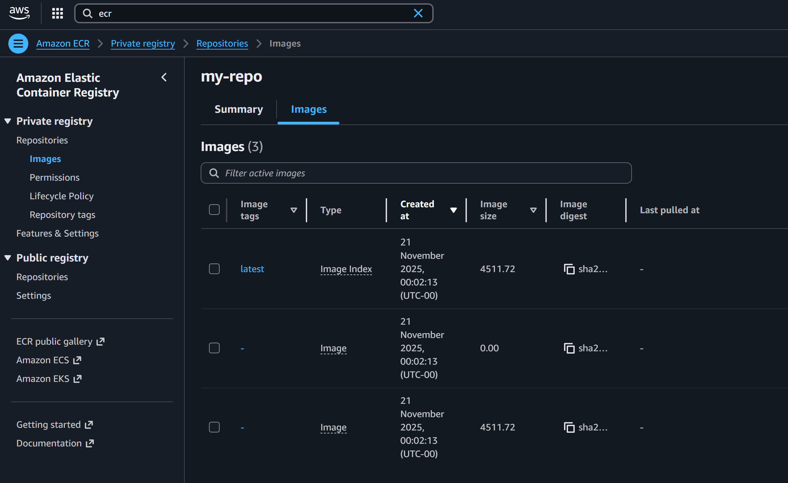
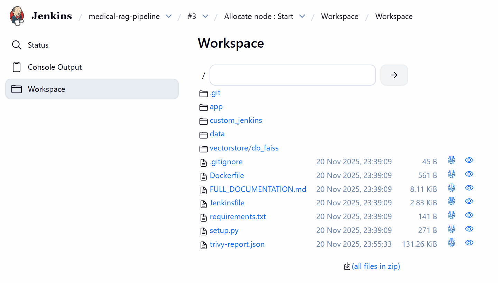

# 🐳 **Docker Build, Trivy Scan, and AWS ECR Push — LLMOps Medical Chatbot**

This branch introduces the full **container security and deployment workflow** for the Medical Chatbot.
Jenkins is now capable of:

* Building the Docker image
* Scanning it for vulnerabilities using **Trivy**
* Authenticating with AWS
* Tagging and pushing the image to **Amazon ECR**

This prepares the project for automated container deployment on AWS infrastructure.

## 🗂️ **Project Structure (Updated)**

```text
LLMOPS-MEDICAL-CHATBOT/
├── Jenkinsfile                 # NEW: ECR build, scan, push stage included
├── custom_jenkins/
│   └── Dockerfile              # Jenkins controller with Docker + Python
├── img/
└── ...
```

## ⚙️ **What Was Implemented in This Branch**

### 🔍 1. Installed Trivy Inside the Jenkins Container

The Jenkins controller was updated to include **Trivy**, enabling high-severity and critical vulnerability scanning of built Docker images:

```bash
docker exec -u root -it jenkins-dind bash
apt install -y
curl -LO https://github.com/aquasecurity/trivy/releases/download/v0.62.1/trivy_0.62.1_Linux-64bit.deb
dpkg -i trivy_0.62.1_Linux-64bit.deb
trivy --version
exit
```

A successful installation shows:

```
Version: 0.62.1
```

The container was then restarted:

```bash
docker restart jenkins-dind
```

### 🔌 2. Installed AWS Plugins in Jenkins UI

Inside Jenkins, the following plugins were installed:

* **Amazon Web Services SDK :: All**
* **AWS Credentials**

This enables IAM authentication and AWS CLI integration.

After plugin installation, the Jenkins container was restarted:

```bash
docker restart jenkins-dind
```

### 👤 3. Created IAM User in AWS for ECR Access

An IAM user named **rag-medical** was created with the policy:

* `AmazonEC2ContainerRegistryFullAccess`

<p align="center">
  
</p>

An **Access Key ID + Secret Access Key** pair was generated for use in Jenkins.

### 🔐 4. Added AWS Credentials to Jenkins

Inside Jenkins:

```
Dashboard → Manage Jenkins → Credentials → Global → Add Credentials
```

* Select type: **AWS Credentials**
* Add Access Key ID + Secret Access Key
* Use ID: `aws-token`

<p align="center">
  
</p>

These credentials allow Jenkins to authenticate to AWS for pushing container images.

### ☁️ 5. Installed AWS CLI Inside Jenkins Container

The Jenkins controller was upgraded to include AWS CLI v2:

```bash
docker exec -u root -it jenkins-dind bash
apt update
apt install -y unzip curl
curl "https://awscli.amazonaws.com/awscli-exe-linux-x86_64.zip" -o "awscliv2.zip"
unzip awscliv2.zip
./aws/install
aws --version
exit
```

A successful install outputs something like:

```
aws-cli/2.32.2 Python/3.13.9 ...
```

Restarted Jenkins:

```bash
docker restart jenkins-dind
```

### 📦 6. Created an ECR Repository

Inside AWS ECR:

* Create Repository
* Name: **my-repo**
* Copy the repository URI for use in the Jenkins pipeline

### 🔧 7. Added the Build → Scan → Push Stage to Jenkinsfile

The Jenkinsfile now includes:

* AWS authentication
* Docker build
* Trivy vulnerability scan
* ECR tagging
* ECR push
* Archiving of the Trivy report

This stage runs automatically whenever the pipeline is triggered.

### 🔒 8. Fixed Docker Daemon Permissions (If Needed)

If Trivy or Docker commands failed due to socket access, permissions were corrected:

```bash
docker exec -u root -it jenkins-dind bash
chown root:docker /var/run/docker.sock
chmod 660 /var/run/docker.sock
usermod -aG docker jenkins
exit

docker restart jenkins-dind
```

### 📸 9. Verified Image in AWS ECR

Upon successful pipeline completion, the new container image appears in AWS ECR:

<p align="center">
  
</p>

### 🛡️ 10. Retrieved and Viewed Trivy Report

Inside Jenkins:

```
Pipeline Run → Workspace
```

A JSON report is generated:

<p align="center">
  
</p>

This report lists HIGH and CRITICAL vulnerabilities detected by Trivy.

## ✅ **Summary**

This branch completes the full container security and publishing pipeline:

* Jenkins builds the Docker image
* Trivy scans it for vulnerabilities
* AWS CLI authenticates with IAM
* Docker image is tagged and pushed to AWS ECR
* Trivy JSON report is archived for auditing

Your system is now fully prepared for cloud deployment and automated image lifecycle management.