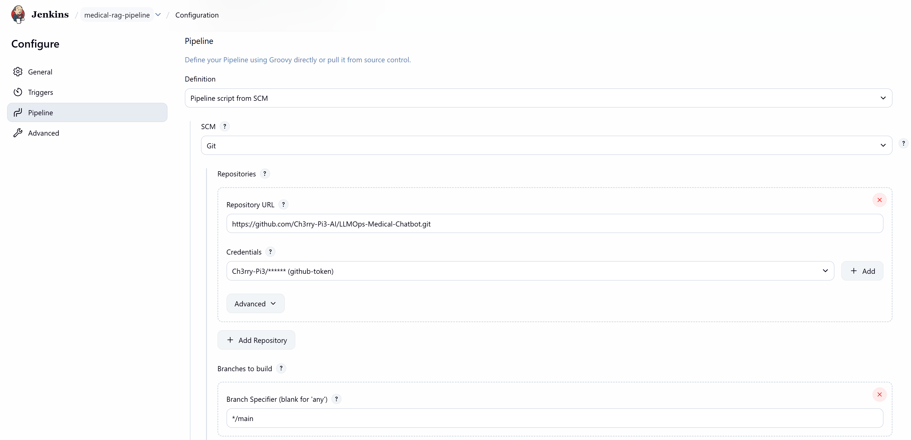
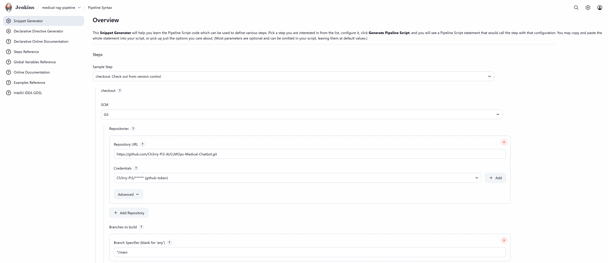

# 🔗 **Jenkins–GitHub Integration — LLMOps Medical Chatbot**

This branch introduces **GitHub integration for Jenkins**, enabling automated CI workflows.
Jenkins can now authenticate with GitHub, fetch the repository, and run the project’s pipeline directly from the `main` branch.

This step configures secure access, Jenkins credentials, and a working pipeline that automatically clones the repository into Jenkins.

## 🗂️ **Project Structure (Updated)**

```text
LLMOPS-MEDICAL-CHATBOT/
├── Jenkinsfile               # NEW: Jenkins pipeline configuration
│
├── custom_jenkins/
│   └── Dockerfile            # Jenkins with Docker-enabled CI support
│
├── app/
│   └── ...
│
└── ...
```

## ⚙️ **What Was Implemented in This Branch**

### 🔐 1. Generated a GitHub Personal Access Token

A GitHub token was created to allow Jenkins to securely pull the repository.

The token includes:

* `repo` scope (full repo access)
* `admin:repo_hook` scope (for webhook integration)

This token replaces the need for GitHub passwords and provides secure CI authentication.

### 🔑 2. Added Token to Jenkins Credentials

A new credential named `github-token` was created in:

```
Jenkins Dashboard → Manage Jenkins → Credentials → Global
```

Credentials stored:

* Username: GitHub username
* Password: The GitHub PAT
* ID: `github-token`
* Description: `github-token`

This ID is referenced inside the Jenkins pipeline for secure authentication.

### 🛠️ 3. Created a New Pipeline Job in Jenkins

A new Jenkins Pipeline project was created:

* Name: e.g. `medical-rag-pipeline`
* Type: Pipeline

A placeholder configuration was saved.

<p align="center">
  
</p>

### 🧩 4. Generated Checkout Script Using Jenkins Pipeline Syntax

From the **Pipeline Syntax** helper, Jenkins generated the required Groovy script for cloning the GitHub repo using stored credentials.

Steps:

* SCM: Git
* URL: GitHub repository
* Credential: `github-token`

<p align="center">
  
</p>

The generated script was copied and used inside the Jenkinsfile.

### 📝 5. Added Jenkinsfile to the Repository

A `Jenkinsfile` was created in the project root containing:

* A declarative pipeline
* A checkout stage using the correct `github-token`
* Proper SCM configuration for the `main` branch

This gives Jenkins a reproducible instruction file for CI runs.

### 📤 6. Pushed the Jenkinsfile to GitHub

The Jenkinsfile was committed and pushed:

```bash
git add Jenkinsfile
git commit -m "Add Jenkinsfile for CI pipeline"
git push origin main
```

### 🚀 7. Triggered the First Pipeline Run

The pipeline was started manually using:

```
Jenkins Dashboard → medical-rag-pipeline → Build Now
```

Once the run completes successfully, Jenkins clones the repository from GitHub into its internal workspace.

### 🎉 CI Integration Successful

With this branch:

* GitHub authentication via PAT is enabled
* Jenkins securely clones the Medical Chatbot repository
* The CI pipeline now starts with a clean, automated checkout step
* The groundwork is set for adding build, test, and deployment stages

This completes the Jenkins–GitHub integration layer.