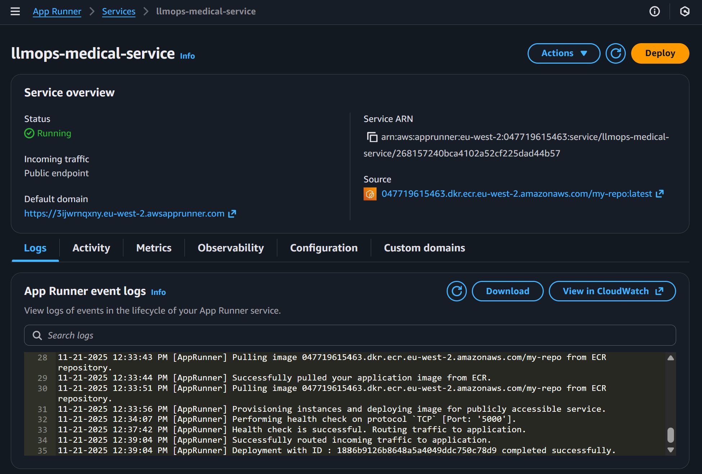
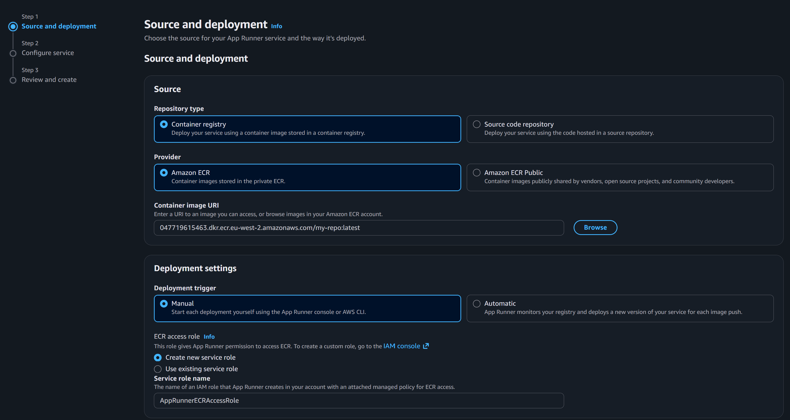
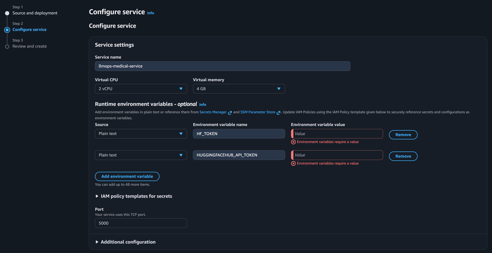
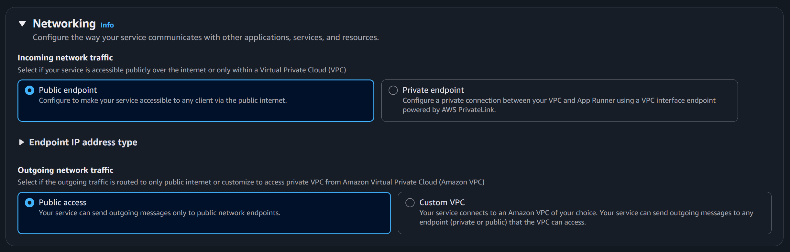

# 🌐 **AWS App Runner Deployment — LLMOps Medical Chatbot**

This branch introduces the final deployment layer of the LLMOps Medical Chatbot: **hosting your containerised RAG application on AWS App Runner**, fully connected to your Jenkins CI/CD pipeline.

With the previous branches handling project setup, utility functions, RAG components, Flask application, Docker packaging, and Jenkins + ECR integration, this final stage enables **push-to-deploy automation** into the cloud.

<p align="center">
  
</p>

Your LLM-powered medical chatbot is now deployed globally, publicly accessible, and continuously updated on every push.

## 🗂️ **Project Structure (Updated)**

```text
LLMOPS-MEDICAL-CHATBOT/
├── app/
│   ├── application.py          # Flask entrypoint
│   ├── components/
│   ├── common/
│   ├── config/
│   ├── templates/
│   └── static/
│
├── custom_jenkins/
│   ├── Dockerfile              # Jenkins-with-Docker-capable build agent
│   └── README.md
│
├── Jenkinsfile                 # Now includes AWS App Runner deployment stage
├── requirements.txt
├── setup.py
├── pyproject.toml
└── README.md
```

## 🚀 **What Was Completed in This Branch**

### 1. Added IAM Permissions for Deployment

An IAM user was configured with:

* `AWSAppRunnerFullAccess`
* Previously required policies (`AmazonEC2ContainerRegistryFullAccess`) remain in place

This allows Jenkins to trigger App Runner deployments programmatically.

### 2. Configured a New AWS App Runner Service

Through the AWS console:

* Selected **Amazon ECR** as the deployment source
* Chose the `my-repo` image produced by Jenkins
* Created a new App Runner service role
* Set runtime, CPU/memory, and environment variables
* Enabled public network access for external reachability

<p align="center">
  
</p>

<p align="center">
  
</p>

<p align="center">
  
</p>

### 3. Finalised CI/CD Integration with Jenkins

With the final stage added to the Jenkinsfile, the pipeline now performs:

1. 📥 **Checkout** from GitHub
2. 🐳 **Build Docker image**
3. 🔍 **Trivy security scan**
4. 📤 **Push to ECR**
5. 🚀 **Trigger AWS App Runner deployment**

The deployment stage automatically calls:

```bash
aws apprunner start-deployment
```

fully automating the rollout of new images.

### 4. Validated Health Checks and Deployment Logs

AWS App Runner logs confirmed:

* Container launched successfully
* Flask app served on port `5000`
* Health checks passed
* Traffic routed correctly

Resulting in production availability:

<p align="center">
  
</p>

## 🧪 **End-to-End Deployment Workflow**

After pushing changes to GitHub:

1. GitHub triggers Jenkins
2. Jenkins executes the full build + scan + push + deploy pipeline
3. A new image is uploaded to ECR
4. App Runner automatically deploys the new version
5. The service becomes publicly accessible within minutes

Your application is now:

* Fully containerised
* Security-scanned
* AWS-hosted
* Auto-deploying
* Production-ready

## 🎉 **Summary**

This branch completes the final step of the LLMOps Medical Chatbot project:

* Cloud-hosted deployment on AWS App Runner
* Fully automated CI/CD pipeline
* Secure build + scan + push process
* Publicly accessible RAG medical chatbot

Your system now runs end-to-end with true enterprise-style reliability and automation.

🚀 **Congratulations — your full LLMOps pipeline is live and complete.**
