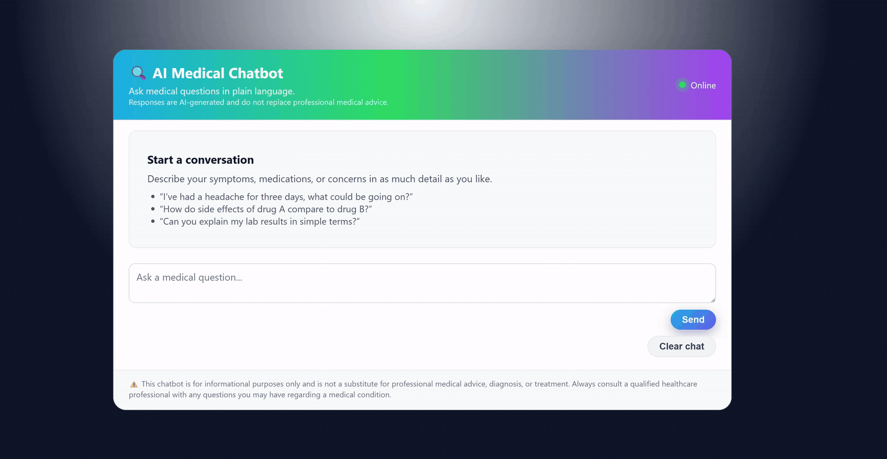

# 🩺 **LLMOps Medical Chatbot — Project Overview**

This repository presents a complete **LLMOps workflow** for an AI-powered **Medical Question-Answering Chatbot**.

The system ingests a large medical reference textbook, builds a **FAISS vector store**, and uses a **Groq-hosted LLM** (via LangChain’s LCEL RAG pipeline) to answer user questions through a **Flask web interface**. The whole stack is:

* Containerised with **Docker**
* Scanned for vulnerabilities with **Trivy**
* Built and pushed by **Jenkins (Docker-in-Docker) to AWS ECR**
* Automatically deployed to **AWS App Runner** via a Jenkins pipeline stage

<p align="center">
  
</p>

The result is a fully automated, cloud-hosted **RAG medical assistant** with robust CI/CD and security scanning.

## 🧩 **Grouped Stages**

|     #     | Stage                                               | Description                                                                                                                                                                                                 |
| :-------: | :-------------------------------------------------- | :---------------------------------------------------------------------------------------------------------------------------------------------------------------------------------------------------------- |
|   **00**  | **Project Setup**                                   | Created the base repository structure, virtual environment, editable install, `.env` handling, dependency management, and core configuration for the medical RAG system.                                    |
| **01–06** | **Core RAG Logic (PDF → Embeddings → Retriever)**   | Implemented the full RAG pipeline: PDF loading, text chunking, embedding generation, FAISS vector store creation, data loading utilities, Groq LLM configuration, and the retriever / LCEL QA chain.        |
|   **07**  | **Flask Web Application**                           | Built the Flask application layer with `application.py`, `index.html`, and custom CSS. Added a clean medical UI, disclaimer, chat-style interface, and session-based message handling.                      |
|   **08**  | **Docker Containerisation**                         | Created the project `Dockerfile` using `python:3.12-slim`. Containerised the Flask app, installed dependencies via editable install, and exposed port `5000` for deployment.                                |
| **09–10** | **Jenkins CI Setup (DIND + GitHub Integration)**    | Built a custom `jenkins-dind` image with Docker installed, ran Jenkins with Docker-in-Docker support, and integrated GitHub via a PAT so Jenkins can securely clone this repository inside the container.   |
|   **11**  | **Secure Container Pipeline (Trivy + AWS ECR)**     | Installed Trivy and AWS CLI inside the Jenkins container, created an ECR repository, and added a Jenkins pipeline stage to build the image, scan it for vulnerabilities, and push it to AWS ECR.            |
|   **12**  | **AWS App Runner Deployment (Auto-Deploy from CI)** | Created an AWS App Runner service pointing at the ECR image, wired a final Jenkins stage to call `aws apprunner start-deployment`, and achieved full push-to-deploy CI/CD from GitHub to a public endpoint. |

## 🗂️ **Project Structure**

```text
LLMOPS-MEDICAL-CHATBOT/
├── app/                                         # 🩺 Core application package
│   ├── __pycache__/                             # ⚡ Python bytecode cache (auto-generated)
│   │
│   ├── common/                                  # 🧱 Shared utilities (logging, exceptions)
│   │   ├── __pycache__/                         # ⚡ Cache for compiled common module code
│   │   ├── custom_exception.py                  # ⚠️ Unified exception handling with rich context
│   │   └── logger.py                            # 🧾 Centralised logging configuration for the project
│   │
│   ├── components/                              # 🧠 RAG pipeline components (PDF → embeddings → retriever)
│   │   ├── __pycache__/                         # ⚡ Cache for compiled component modules
│   │   ├── data_loader.py                       # 📥 Orchestrates loading of FAISS index, embeddings, and config
│   │   ├── embeddings.py                        # 🔡 Embedding model setup (e.g. HuggingFace/BGE) for vectorisation
│   │   ├── llm.py                               # 🤖 Groq LLM client configuration and model selection
│   │   ├── pdf_loader.py                        # 📚 Loads and chunks the medical PDF into manageable text segments
│   │   ├── retriever.py                         # 🔍 LangChain LCEL RAG chain: retriever + prompt + LLM + output parsing
│   │   └── vector_store.py                      # 🧊 FAISS vector store creation, persistence, and retrieval interface
│   │
│   ├── config/                                  # ⚙️ Configuration layer
│   │   ├── __pycache__/                         # ⚡ Compiled config module cache
│   │   └── config.py                            # 📌 Central config (paths, model names, chunk sizes, etc.)
│   │
│   ├── static/                                  # 🎨 Front-end static assets (CSS, images, etc. for Flask)
│   │   └── style.css                            # 💅 Custom CSS styling for the medical chatbot UI
│   │
│   ├── templates/                               # 🧩 Jinja2 templates for the Flask web interface
│   │   └── index.html                           # 🗨️ Main chat UI template (messages panel, input area, disclaimer)
│   │
│   ├── application.py                           # 🌐 Flask entrypoint: routes, session chat handling, error display
│   └── README.md                                # 📖 App-level documentation (not listed in this tree by design)
│
├── custom_jenkins/                              # 🛠️ Custom Jenkins controller image (with Docker installed)
│   └── Dockerfile                               # 🐳 Jenkins LTS base + docker.io + group permissions for DinD
│
├── data/                                        # 📂 Source medical reference documents
│   └── The_GALE_ENCYCLOPEDIA_OF_MEDICINE_SECOND.pdf   # 📖 Ingested PDF used to build the medical knowledge base
│
├── img/                                         # 🖼️ Documentation and UI / deployment screenshots
│   ├── flask/
│   │   └── flask_app.gif                        # 🎬 Demo GIF of the Flask medical chatbot in action
│   │
│   ├── aws/                                     # ☁️ AWS-related screenshots (ECR, Trivy report, permissions)
│   │   ├── permissions.png                      # 🔐 IAM permissions for ECR/App Runner access
│   │   ├── jenkins_aws_token.png                # 🔑 Jenkins AWS credentials configuration
│   │   ├── repo_image.png                       # 🐳 ECR repository showing pushed Docker image
│   │   └── trivy_report.png                     # 🛡️ Trivy vulnerability report visual in Jenkins workspace
│   │
│   └── runner/                                  # 🌐 AWS App Runner configuration screenshots
│       ├── source_deployment.png                # 📦 App Runner source configuration (ECR image selection)
│       ├── configure.png                        # ⚙️ Runtime, CPU/memory, and environment configuration
│       ├── networking.png                       # 🌍 Networking config for public endpoint and access
│       └── services_success.png                 # ✅ App Runner service in healthy, deployed state
│
├── llmops_medical_chatbot.egg-info/             # 📦 Python packaging metadata (auto-generated by editable install)
│
├── logs/                                        # 📝 Runtime logs directory (created during execution)
│
├── vectorstore/                                 # 🧊 Persisted FAISS index artefacts
│   └── db_faiss/
│       ├── index.faiss                          # 📈 FAISS index file storing vector embeddings
│       └── index.pkl                            # 🧾 Python metadata for the FAISS index (e.g. embeddings model info)
│
├── .env                                         # 🔐 Local environment variables (GROQ_API_KEY, etc. – not committed)
├── .gitignore                                   # 🚫 Git ignore rules (venv, .env, caches, etc.)
├── .python-version                              # 🐍 Python version pin for tooling (e.g. pyenv)
├── Dockerfile                                   # 🐳 Application container definition (Flask + dependencies)
├── Jenkinsfile                                  # ⚙️ Jenkins pipeline (clone → build → Trivy scan → ECR push → App Runner deploy)
├── pyproject.toml                               # 🧩 Project metadata and dependency configuration for editable install
├── README.md                                    # 📘 Main project documentation (this file)
├── requirements.txt                             # 📦 Explicit Python dependency list (for environments without `pyproject` tooling)
├── setup.py                                     # 🔧 Legacy/compat setup for `pip install -e .`
└── uv.lock                                      # 🔒 Locked dependency versions for reproducible environments
```

## 🚀 **End-to-End Workflow**

From a developer’s perspective, the full workflow is:

1. **Local development**

   * Edit RAG components in `app/components/`
   * Adjust configuration in `app/config/config.py`
   * Tweak UI in `app/templates/index.html` and `app/static/style.css`

2. **Run locally**

   * Start the Flask app (via `application.py`)
   * Interact with the RAG medical assistant through the browser

3. **Container build and security**

   * Jenkins (running in a custom DinD image) builds the Docker image
   * Trivy scans the image for **HIGH/CRITICAL** vulnerabilities
   * The image is tagged and pushed to **AWS ECR**

4. **Cloud deployment**

   * AWS App Runner pulls the latest ECR image
   * Health checks confirm the Flask app is running on port `5000`
   * Traffic is routed to the public endpoint, serving the medical chatbot

## 🎉 **Summary**

The **LLMOps Medical Chatbot** demonstrates how to take a domain-specific, safety-conscious RAG system from:

* 📚 **Raw medical PDF**
* 🔡 **Embeddings and FAISS vector store**
* 🤖 **Groq-hosted LLM with a medical prompt**
* 🌐 **Flask web UI**
* 🐳 **Docker container**
* 🛠️ **Jenkins CI (Docker-in-Docker)**
* 🛡️ **Trivy security scanning**
* ☁️ **AWS ECR and App Runner**

and combine them into a single, automated **LLMOps pipeline** that delivers a production-ready, cloud-hosted medical assistant.

Your pushes to GitHub now flow all the way through to a **live, auto-deployed App Runner service**, giving you a robust, real-world MLOps / LLMOps portfolio project.
